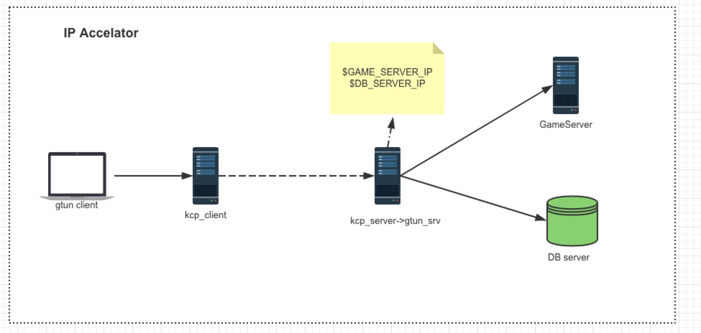
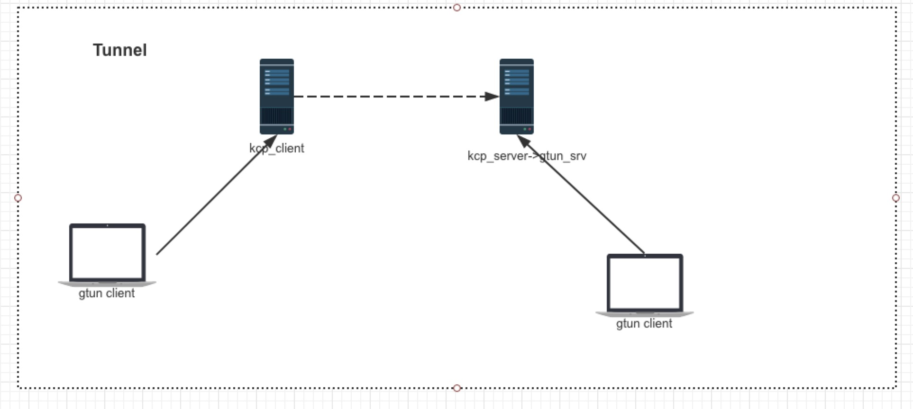

[](https://travis-ci.org/ICKelin/gtun)
### gtun
Gtun is a game or ip accelator written in golang.  Currently only support mac os and linux.

### Build

```

./makefile.sh

```

More information, reference.travils.yml

### example

- ip accelator



- tunnel



### thanks
[songgao/water](https://github.com/songgao/water)

### more
[tun/tap vpn](https://github.com/ICKelin/article/issues/9)

any [issues](https://github.com/ICKelin/gtun/issues/new) are welcome

