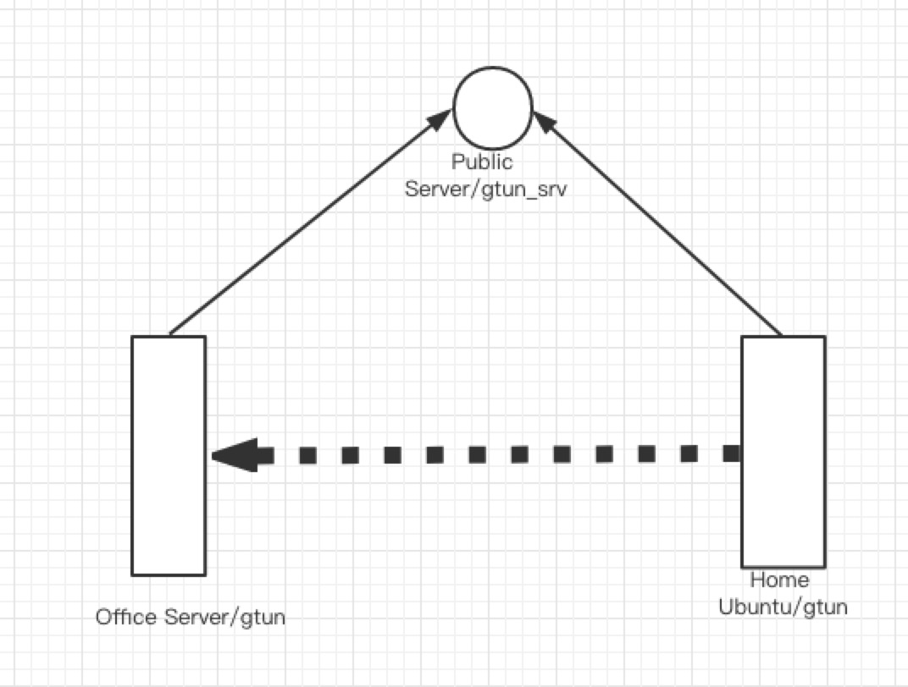

### gtun
gtun is a vpn written in golang for diffrent area to connect like a local area network. 

currently only support for linux operating system

### usage

```

build

go build -o gtun_srv gtun_srv.go
go build -o gtun gtun.go

deploy server in public network environment e.g $SRV_IP
nohup ./gtun_srv &

deploy client 
nohup ./gtun -s "$SRV_IP:SRV_PORT" &

ifconfig cmd you will get a tun device wiht an ip delivery by gtun_srv


```

### example

eg
connect between you office and home computer

running gtun in you office server and home computer, ssh the gtun nic ip and you will access you office environment.

also, run gtun in you public server is allow, and there is no need to run gtun for every staff. connect to public server and will access to all gtun client, public server is just like a jumper server.



### more
[tun/tap vpn](https://github.com/ICKelin/article/issues/9)

### thanks
[songgao/water](https://github.com/songgao/water)