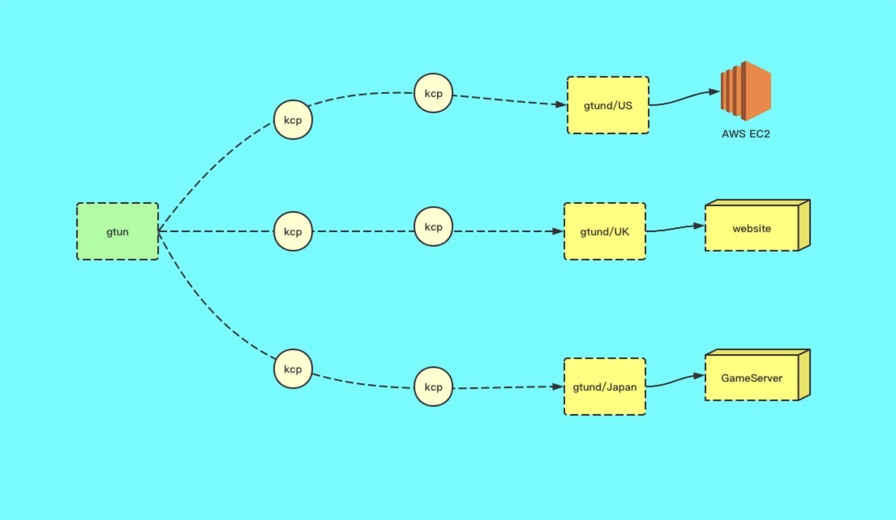

## gtun
<a href="">

</a>
<a href="https://goreportcard.com/report/github.com/ICKelin/gtun" rel="nofollow">

</a>

<a href="https://travis-ci.org/ICKelin/gtun" rel="nofollow">

</a>
<a href="https://github.com/ICKelin/gtun/blob/master/LICENSE">

</a>

gtun是一款开源的ip代理加速软件，目前只支持linux，通过`tproxy`技术实现流量劫持，`quic`和`kcp`等协议优化广域网传输，gtun提供一个基础通道，所有加入`ipset`的ip的流量都会被gtun进行拦截并代理到指定出口。
gtun支持多线路配置，可以同时对美国，日本，欧洲目的网络进行加速访问。您可以结合dnsmasq来使用，将需要配置加速的域名解析结果加入ipset，从而实现域名加速。

[](https://www.youtube.com/watch?v=pxv02e5EXPE "")

同时我们也基于gtun开发了收费版本，对标阿里云的全球应用加速，ucloud的pathX等产品的功能，只是会更加灵活，支持私有化部署，独立部署，可以部署到公有云，数据中心和软路由，如果您感兴趣，可以访问[我们的网站](https://www.beyondnetwork.net)进行免费免费体验。

关于项目有任何问题需要咨询，可以[联系作者](#关于作者)进行交流

## 目录
- [介绍](#gtun)
- [应用场景](#应用场景)
- [功能特性](#功能特性)
- [技术原理](#技术原理)
- [安装部署](#安装部署)
  - [前期准备](#前期准备)
  - [安装运行gtund](#安装运行gtund)
  - [安装运行gtun](#安装运行gtun)
  - [配置加速ip](#配置加速ip)
  - [加速效果测试](#加速效果)
- [用法玩法]()
  - [基础用法: 基于gtun+ipset实现ip代理加速和分流](doc/基础用法:基于gtun+ipset实现ip代理加速和分流.md)
  - [基础用法: 基于gtun+dnsmasq实现域名代理加速和分流](doc/基础用法:基于gtun+dnsmasq实现域名代理加速和分流.md)
  - [基础用法: openwrt搭载gtun打造加速软路由，连接Wi-Fi即可畅游网络](doc/基础用法:openwrt搭载gtun打造加速软路由，连接Wi-Fi即可畅游网络.md)
  - [基础用法: 基于gtun实现公有云访问外部加速](doc/基础用法:基于gtun实现公有云访问外部加速.md)
  - [玩转N1盒子：基于gtun实现的tiktok加速路由](doc/玩转N1盒子:基于gtun实现的tiktok加速路由.md)
  - [玩转N1盒子：基于gtun实现的游戏加速盒](doc/玩转N1盒子:基于gtun实现的游戏加速盒.md)
- [有问题怎么办](#有问题怎么办)
- [关于作者](#关于作者)

## 应用场景

- SaaS软件加速，加速访问Salesforce，offce365等产品
- 云服务器加速，加速访问海外服务器，跳板机，提升操作流畅度
- 直播加速，tiktok海外直播加速，抖音直播加速
- 游戏加速，结合专线网络和路由盒子实现游戏加速盒
- 云服务器出口加速网关，加速整个公有云内网访问外网的流量

[返回目录](#目录)

## 功能特性

- 纯应用层实现，不存在overlay网络，支持tcp和udp协议以及运行在其上的所有七层协议
- 支持ip加速，配合dnsmasq等软件可支持域名加速场景
- 支持多链路容灾和竞速
- 支持动态和静态内容访问加速
- 引入`kcp`，`quic`等协议优化跨境传输

[返回目录](#目录)

## 技术原理


<center><p>整体架构</p></center>
gtun是一款ip正向代理软件，包含代理客户端gtun和服务端gtund，如上图所示，gtun作为所有流量的入口，也即是正向代理的客户端，gtund作为所有流量的出口，也即是正向代理的服务端，gtun的客户端比较重，服务端程序则非常的轻量级。

gtun最主要的功能是流量代理，gtun经过三个版本的演变，最初基于tun网卡的vpn技术，然后优化到dnat技术，再到目前的tproxy技术，现已逐步趋于稳定。

gtun本身只提供流量代理通道，至于哪些流量需要被劫持，**这个是由使用者定义的**，使用者最终只需要将被代理的IP加入到`ipset`当中，那么该ipset的ip就会被代理

为了实现更加快速的代理，gtun考虑集成`kcp`或者`quic`等基于UDP实现的可靠性传输协议，同时接入FEC，实时选路等机制，以避免长链路tcp丢包严重触发拥塞控制机制，降低传输效率。

[返回目录](#目录)

## 安装部署
在这一节当中结合实际应用场景说明如何安装和部署gtun和gtund程序，在本应用场景当中，通过配置IP代理加速，加快访问speedtest的测速文件

### 前期准备

- 一台公有云服务器，用于部署服务端程序gtund，区域越靠近被加速区域（源站）越好，并且确认gtund监听的端口被打开
- 另外一台可以是公有云服务器，也可以是内网机器，也可以是路由器，用于部署客户端程序gtun，目前gtun只支持linux系统

### 安装运行gtund
gtund部署在美国的AWS上，支持systemd和docker两种方式进行启动。

在[release](https://github.com/ICKelin/gtun/releases)里面找到2.0.8版本的产物并进行下载，

```
cd gtund
./install.sh
```
install.sh 会创建gtund的运行目录，并通过systemd把gtund程序拉起。
执行install.sh完成之后，gtund会：
- 监听tcp的3002作为mux协议的服务端口
- 监听udp的3002作为kcp协议的服务端口
- 监听udp的4002作为quic协议的服务端口
- 日志记录在/opt/apps/gtund/logs/gtund.log

gtund的默认配置为，默认情况下不需要作任何的修改即可

```yaml
enable_auth: true
auths:
  - access_token: "ICKelin:free"
    expired_ath: 0

trace: ":3003"
server:
  - listen: ":3002"
    scheme: "kcp"

  - listen: ":3002"
    scheme: "mux"
    
  - listen: ":4002"
    scheme: "quic"

log:
  days: 5
  level: "debug"
  path: "/opt/apps/gtund/logs/gtund.log"

```

您也可以使用docker-compose来进行安装：

```shell
cd gtund
docker-compose up --build -d
```

执行完之后docker ps 看是否启动成功

[返回目录](#目录)

### 安装运行gtun

gtun的安装也类似，在[release](https://github.com/ICKelin/gtun/releases)里面找到2.0.8版本的产物并进行下载，然后在本地linux上进行部署

```shell
cd gtun
export ACCESS_TOKEN="ICKelin:free"
export SERVER_IP="gtund所在的服务器的ip"
./install.sh
```

其中ACCESS_TOKEN为gtund配置的认证的token，SERVER_IP是gtund的公网IP

安装完成之后查看是否有错误日志

同样，你也可以使用docker-compose来安装

```shell
cd gtun
docker-compose up --build -d
```

执行完成之后docker ps 看是否启动成功。

[返回目录](#目录)

### 配置加速ip

在上述过程中，启动了gtun和gtund程序，但是并未添加任何需要加速的信息，那么gtun如何进行加速呢？需要额外手动配置加速ip，并将该ip的tcp流量全部转发至127.0.0.1:8524端口，udp流量全部转发至127.0.0.1:8524∂端口。

这个过程是通过ipset和路由来配置的。以1.1.1.1为例

第一步，创建ipset，并将1.1.1.1加入其中
```
ipset create GTUN-US hash:net
ipset add GTUN-US 1.1.1.1
```

第二步，创建iptables规则，匹配目的ip为GTUN-US这个ipset内部的ip，然后做tproxy操作，将流量重定向到本地8524和8524端口

```
iptables -t mangle -I PREROUTING -p tcp -m set --match-set GTUN-US dst -j TPROXY --tproxy-mark 1/1 --on-port 8524
iptables -t mangle -I PREROUTING -p udp -m set --match-set GTUN-US dst -j TPROXY --tproxy-mark 1/1 --on-port 8524
iptables -t mangle -I OUTPUT -m set --match-set GTUN-US dst -j MARK --set-mark 1
```

第三步，添加路由表

```
ip rule add fwmark 1 lookup 100
ip ro add local default dev lo table 100
```

至此所有配置都已经完成，后续需要新增代理ip，只使用以下命令将ip加入GTUN-US这个ipset当中即可，现在可以先尝试测试1.1.1.1这个ip的代理。

```
root@raspberrypi:/home/pi# nslookup www.google.com 1.1.1.1
Server:		1.1.1.1
Address:	1.1.1.1#53

Non-authoritative answer:
Name:	www.google.com
Address: 142.250.73.228
```

[返回目录](#目录)

### 加速效果

有了上述的基础，现在可以进行下载速度测试对比，以`http://speedtest.atlanta.linode.com/100MB-atlanta.bin`这个文件作为测试，

首先是通过gtun代理加速之后的测试，需要将`speedtest.atlanta.linode.com`加入到GTUN-US当中

`ipset add GTUN-US speedtest.atlanta.linode.com`

```shell
root@raspberrypi:/home/pi# wget http://speedtest.atlanta.linode.com/100MB-atlanta.bin -v
--2021-05-18 22:00:23--  http://speedtest.atlanta.linode.com/100MB-atlanta.bin
正在解析主机 speedtest.atlanta.linode.com (speedtest.atlanta.linode.com)... 50.116.39.117, 2600:3c02::f03c:91ff:feae:641
正在连接 speedtest.atlanta.linode.com (speedtest.atlanta.linode.com)|50.116.39.117|:80... 已连接。
已发出 HTTP 请求，正在等待回应... 200 OK
长度：104857600 (100M) [application/octet-stream]
正在保存至: “100MB-atlanta.bin”

100MB-atlanta.bin                   100%[==================================================================>] 100.00M  2.39MB/s    in 57s

2021-05-18 22:01:21 (1.77 MB/s) - 已保存 “100MB-atlanta.bin” [104857600/104857600])
```

然后通过正常网络测试，将`speedtest.atlanta.linode.com`从GTUN-US当中移除即可

`ipset del GTUN-US speedtest.atlanta.linode.com`

```
root@raspberrypi:/home/pi# wget http://speedtest.atlanta.linode.com/100MB-atlanta.bin -v
--2021-05-18 22:04:44--  http://speedtest.atlanta.linode.com/100MB-atlanta.bin
正在解析主机 speedtest.atlanta.linode.com (speedtest.atlanta.linode.com)... 50.116.39.117, 2600:3c02::f03c:91ff:feae:641
正在连接 speedtest.atlanta.linode.com (speedtest.atlanta.linode.com)|50.116.39.117|:80... 已连接。
已发出 HTTP 请求，正在等待回应... 200 OK
长度：104857600 (100M) [application/octet-stream]
正在保存至: “100MB-atlanta.bin.1”

100MB-atlanta.bin.1                   0%[                                                                   ]   1012K  9.50KB/s    eta 98m 58s
```

可以看见，通过gtun加速之后，速度可以达到2.39MB/s，而未通过gtun加速的正常下载速度则为15KB/s左右的速度，两者差了一个数量级。

[返回目录](#目录)

## 有问题怎么办

- [wiki](https://github.com/ICKelin/gtun/wiki)
- [查看文档]()
- [提交issue](https://github.com/ICKelin/gtun/issues)
- [查看源码](https://github.com/ICKelin/gtun)
- [联系作者交流解决](#关于作者)

[返回目录](#目录)

## 关于作者
一个爱好编程的人，网名叫ICKelin。对于以下任何问题，包括

- 项目实现细节
- 项目使用问题
- 项目建议，代码问题
- 案例分享
- 技术交流

可加微信: zyj995139094