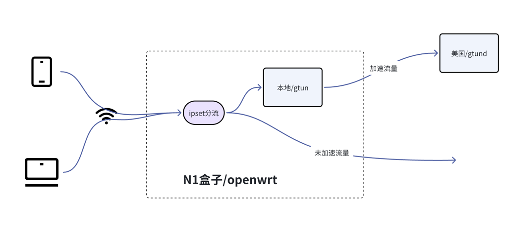
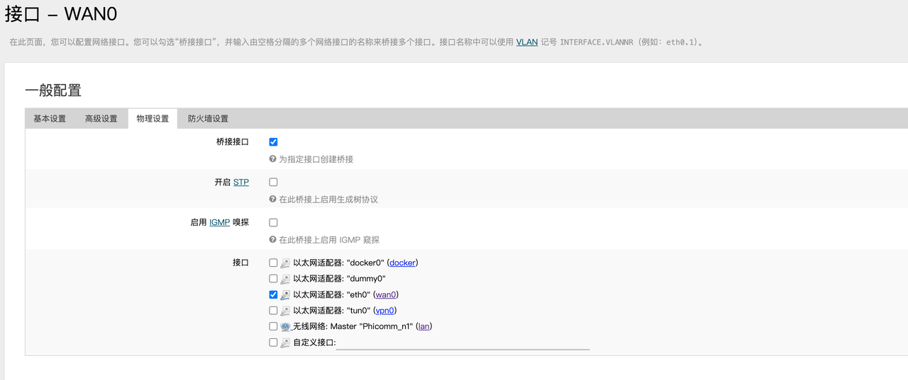
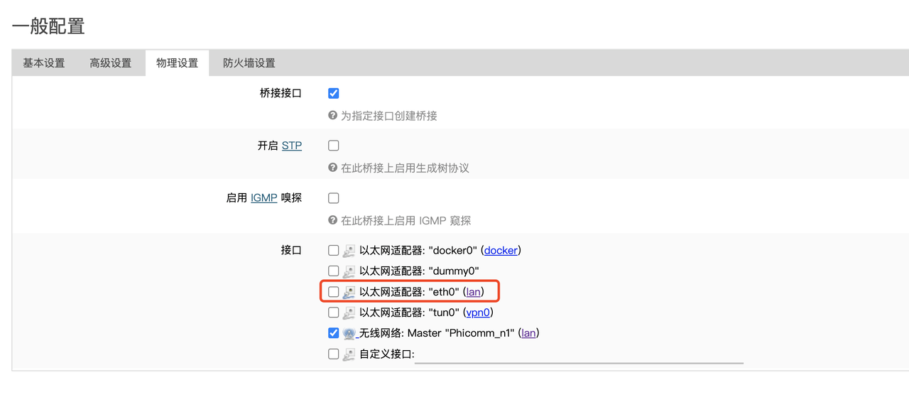
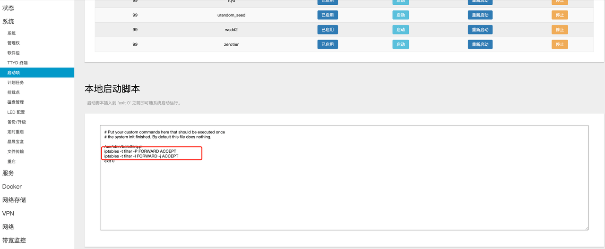
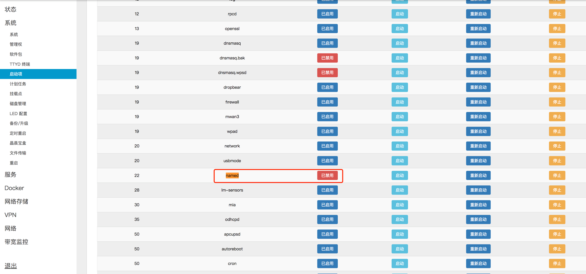

# openwrt搭载gtun打造加速软路由，连接Wi-Fi即可畅游网络
之前两篇文章都介绍的是如何加速本机的，但是实际过程中我们希望能够连接上Wi-Fi就能够进行访问加速，这个就需要用到软路由。

本文将详细介绍如何打造一个基于gtun加速的软路由，最终实现的效果是家里的任何一台设备，只要连上Wi-Fi，不需要任何配置就能够实现加速。

依照之前文章的习惯，我们首先来看一下本文的拓扑：



如图所示：
- N1盒子，网上很多，很便宜就能买到，买了之后自己刷入openwrt，N1盒子有无线Wi-Fi功能，不需要配置旁路由，只要连上N1盒子的Wi-Fi就行
- gtun部署在N1盒子上，由于gtun是基于iptables来匹配流量转发的，因此能够实现
  - 本机流量劫持和加速
  - 作为路由器时，经过本机路由转发的流量的加速
- 除了N1盒子和gtun之外，由于openwrt本身就已经刷入dnsmasq了，这里不再多说，dnsmasq的域名策略还是沿用[之前文章](基础用法:基于gtun+dnsmasq实现域名代理加速和分流.md)的配置。

**本文是基于gtun的2.0.7版本。**

其他文章参考:

- [基础用法: 基于gtun+ipset实现ip代理加速和分流](./基础用法:基于gtun+ipset实现ip代理加速和分流.md)
- [基础用法: 基于gtun+dnsmasq实现域名代理加速和分流](./基础用法:基于gtun+dnsmasq实现域名代理加速和分流.md)
- [基础用法: openwrt搭载gtun打造加速软路由，连接Wi-Fi即可畅游网络](./基础用法:openwrt搭载gtun打造加速软路由，连接Wi-Fi即可畅游网络.md)
- [基础用法: 基于gtun实现公有云访问外部加速](./基础用法:基于gtun实现公有云访问外部加速.md)
- [玩转N1盒子：基于gtun实现的tiktok加速路由](./玩转N1盒子:基于gtun实现的tiktok加速路由.md)
- [玩转N1盒子：基于gtun实现的游戏加速盒](./玩转N1盒子:基于gtun实现的游戏加速盒.md)

# N1盒子刷入Openwrt
- N1盒子是从淘宝购买的
- openwrt我刷入的是[这个固件](https://github.com/ophub/flippy-openwrt-actions/releases/download/OpenWrt_lede_save_2024.04/openwrt_s905d_n1_R24.2.2_k5.15.152-flippy-88+o.img.gz)

操作很简单，下载刷入u盘之后插入N1盒子（已经设置自动u盘启动），
然后执行install-to-emmc.sh选择11刷入emmc，成功之后拔掉u盘重启，进入openwrt。

操作完成之后你会得到以下信息: 
- Wi-Fi名称：Phnicomm_n1
- Wi-Fi密码：password
- 终端用户名：root
- 终端密码：password
- Wi-Fi网段：192.168.1.1/24

接下来需要配置上网：
- 创建wan口并且桥接到eth1




- 去掉lan口的桥接



- 开机自启脚本加入两条命令
```shell
iptables -t filter -P FORWARD ACCEPT
iptables -t filter -I FORWARD -j ACCEPT
```


操作完成之后就可以通过连接N1盒子的Wi-Fi上网了。

N1盒子本身有两个服务监听的udp 53端口，我们需要把named服务停掉，避免解析时候不知道使用的是哪个服务解析。



# 部署程序
部署程序和配置没有太多特别之处，参考这两篇文章进行：

- [基础用法:基于gtun+ipset实现ip代理加速和分流](./基础用法:基于gtun+ipset实现ip代理加速和分流.md)
- [基础用法:基于gtun+dnsmasq实现域名代理加速和分流](./基础用法:基于gtun+dnsmasq实现域名代理加速和分流.md)

# 结束语
完成上面两个步骤之后就能连接N1盒子的Wi-Fi实现，相比较之前的而言，除了搭载硬件不一样，其他的没有太大的区别，配置几乎是一样的。

gtun的灵活之处在于它提供的是一个基础功能，不关注你底层跑的硬件是什么，
底层的线路是什么，转发规则怎么配置，只要你按照我们约定好的ipset进行配置，就无脑转发。
