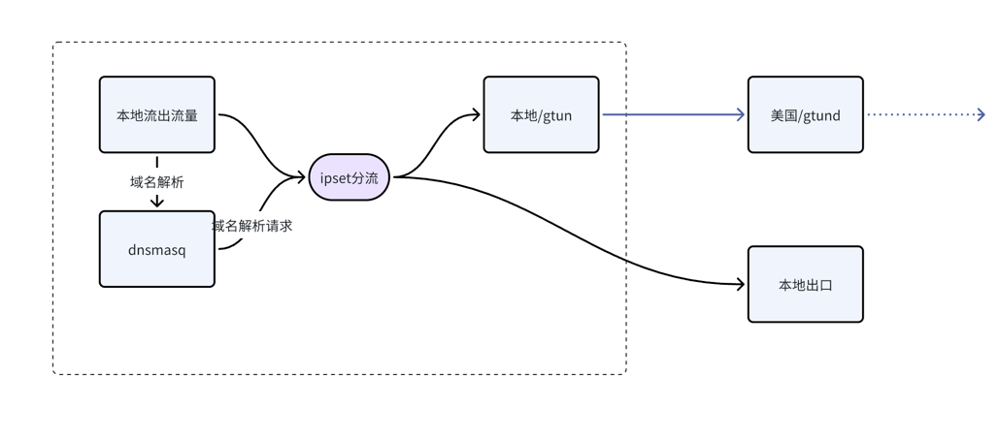

# 基于gtun+dnsmasq实现域名代理加速和分流.md

之前的文章分享了[使用gtun实现ip代理加速和分流](./基础用法:基于gtun+ipset实现ip代理加速和分流.md)，实现了一个最简单的基于ip代理加速的场景，但是在实际应用当中会有两个不太优雅的地方：

- 基于ip的方式，如果ip发生变动，可能会出现分流策略不准的问题
- 有时候并不需要加速这么多ip，只需要加速部分网站或者应用即可（非常典型的比如SaaS应用加速）
- 考虑一下真正使用的时候，dns应该如何配置，如果配置成114.114.114.114，那么需要通过8.8.8.8来进行解析的ip则会被污染，如果设置成8.8.8.8，那么国内的网站可能会解析到国外的ip，这也算是一种dns污染

基于此我们有了基于dnsmasq的域名解析策略来实现基于域名的加速和分流，希望能够解决这三个问题，最终拓扑如下：



# 前置准备
您可以参考[这篇文章](基础用法:基于gtun+ipset实现ip代理加速和分流.md)来安装gtund和gtun。安装完gtun和gtund之后，您需要再安装dnsmasq并且成功启动。

# 配置dnsmasq解析策略

首先还是创建好基本的运行环境，参考`gtun/scripts/redirect_all.sh`

然后配置dnsmasq的规则，dnsmasq的规则主要有两个：
 
- 域名解析的上游地址是多少，针对大陆地区的域名，使用114.114.114.114来进行解析，针对其他域名，使用8.8.8.8进行解析
- 解析接入写入到哪个ipset里面，针对大陆地区的域名，写入到NOPROXY当中，海外域名不进行处理，因为在GTUN_ALL里面已经匹配除了NOPROXY之外的所有ip

通过这两个控制我们就能够实现dnsmasq和gtun的无缝结合，双方都不需要感知对方的存在，dnsmasq只管结果写进ipset，gtun只管匹配ipset，通过ipset来实现进程之间的默契。

```shell
config_dnsmasq() {
    echo "configuring dnsmasq service"
    cp dnsmasq/dnsmasq.conf /etc/dnsmasq.conf
    cp dnsmasq/dnsmasq.resolv /etc/dnsmasq.resolv
    echo "configuring dnsmasq cn domain list"
    cp dnsmasq/cn.conf /etc/dnsmasq.d/
    cp dnsmasq/cn_set.conf /etc/dnsmasq.d/
    systemctl restart dnsmasq
}

```

完整命令可以参考`gtun/scripts/redirect_domains.sh`。修改完之后本机需要设置`/etc/resolv.conf`文件的`nameserver 127.0.0.1`，
只有这样才会真正用本机的dnsmasq去解析。后面我会介绍软路由的方式，让其他机器通过配置好gtun的软路由也能使用这种代理和分流的策略。

# 测试
接下来进行一轮测试，我们使用我们自己的一个域名`demo.xxxx.tech`进行测试。

第一步将demo.xxxx.tech配置进dnsmasq里面

```shell
root@OpenWrt:~/gtun# head /etc/dnsmasq.d/cn.conf
server=/demo.xxxx.tech/114.114.114.114

root@OpenWrt:~/gtun# head /etc/dnsmasq.d/cn_set.conf
ipset=/demo.xxxx.tech/NOPROXY
```

第二步nslookup解析测试

```shell
root@OpenWrt:~/gtun# nslookup demo.xxxx.tech 127.0.0.1
Server:		127.0.0.1
Address:	127.0.0.1:53

Non-authoritative answer:
Name:	demo.xxxx.tech
Address: 47.115.xx.xx

Non-authoritative answer:

root@OpenWrt:~/gtun# ipset -T NOPROXY 47.115.xx.xx
Warning: 47.115.xx.xx is in set NOPROXY.
```

demo.xxxx.tech这个域名已经被加入到NOPROXY里面了，根据之前的文章，加入到NOPROXY之后不会再走加速出口出，这里不再赘述了。

# 结束语
最后我们回到文章一开始提到的三个问题。

首先是ip不准的问题，本文通过域名来实现控制，不是事先写入固定的cidr列表来判断的。

其次是部分加速的需求，这个也同样可以综合域名和IP来实现

最后是dns应该用哪个？本文已经给出了答案，把dns设置为127.0.0.1，交给dnsmasq来判断应该用`114.114.114.114`还是`8.8.8.8`

截止目前位置我们已经了解到了ip加速和域名加速，但是所有的加速都是加速本机的流量，接下来我会结合 软路由的方式，详细说明如何实现连接Wi-Fi就能实现gtun的加速。
