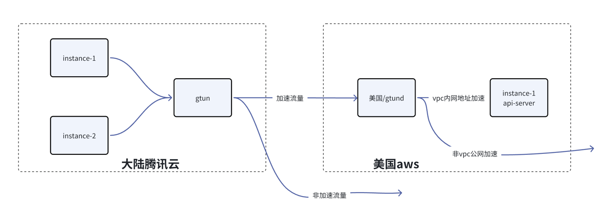

# 基于gtun实现公有云访问外部加速
之前的三篇教程都偏向于本地加速的，在云场景下也能实现类似的代理加速功能，公有云场景和旁路由非常类似，

本文通过配置一个部署了gtun云网关，让所有vpc的访问流量都通过这台服务器作为加速网关，能够实现两个基本的功能：

- vpc内访问加速，比如现在AI发展迅猛，很多企业都需要在公有云上下载大模型，那么通过配置gtun的加速网关能够解决这一场景
- 跨vpc的单边访问，比如有大陆和美国两个公有云，通过配置对端vpc的网段加速，就能实现大陆vpc通过内网ip访问美国的vpc。

依照惯例，我们还是先看一看拓扑图。



- 包含大陆腾讯云和美国aws
- 美国aws找一台云服务器部署gtund，同时内网开启一个api-server进行测试验证
- 大陆腾讯云找一台云服务器部署gtun，同时内网有其他实例，通过配置vpc路由把流量转到gtun所在的云服务器上

> ⚠️
> gtun的云服务器相当于一个路由器，如果该云服务器宕机，会影响到其他实例的网络可用性

那么接下来开始具体的配置。

**本文是基于gtun的2.0.7版本。**

其他文章参考:

- [基础用法: 基于gtun+ipset实现ip代理加速和分流](./基础用法:基于gtun+ipset实现ip代理加速和分流.md)
- [基础用法: 基于gtun+dnsmasq实现域名代理加速和分流](./基础用法:基于gtun+dnsmasq实现域名代理加速和分流.md)
- [基础用法: openwrt搭载gtun打造加速软路由，连接Wi-Fi即可畅游网络](./基础用法:openwrt搭载gtun打造加速软路由，连接Wi-Fi即可畅游网络.md)
- [基础用法: 基于gtun实现公有云访问外部加速](./基础用法:基于gtun实现公有云访问外部加速.md)
- [玩转N1盒子：基于gtun实现的tiktok加速路由](./玩转N1盒子:基于gtun实现的tiktok加速路由.md)
- [玩转N1盒子：基于gtun实现的游戏加速盒](./玩转N1盒子:基于gtun实现的游戏加速盒.md)

# 程序安装
这个之前的文章已经详细介绍了，并没有太多的区别，可以参考下面文章来进行配置

[基础用法:基于gtun+ipset实现ip代理加速和分流](./基础用法:基于gtun+ipset实现ip代理加速和分流.md)

# 配置
首先清理GTUN_ALL配置的加速列表和NOPROXY的加速列表

```shell
ipset -F GTUN_ALL
ipset -F NOPROXY
```

这两个操作完之后就是一个不配置任何加速的空跑的gtun服务，然后开始配置

配置包括两个方面：

- gtun所在云服务器的转发规则（ipset操作）
- 公有云的路由表

本文包括两个场景：

- 美国公有云vpc网段的加速
- 非vpc网段的加速

首先配置vpc网段的加速。

第一步，把对端vpc的cidr加入到GTUN_ALL这个ipset当中

```shell
ipset add GTUN_ALL 172.31.0.0/16 
```

配置完这一步之后你就可以在gtun所在的云服务器通过对端服务器的内网地址访问到对端的服务。

我们启动一个http server来进行测试

```shell
root@ip-172-31-3-157:~# python3 -m http.server 12590

# 在大陆腾讯云通过curl访问测试
root@iZwz97kfjnf78copv1ae65Z:~# curl 172.31.3.157:12590 >/dev/null
  % Total    % Received % Xferd  Average Speed   Time    Time     Time  Current
                                 Dload  Upload   Total   Spent    Left  Speed
100   835  100   835    0     0   3255      0 --:--:-- --:--:-- --:--:--  3261

# 观察输出，来源IP是gtund所在服务器的内网IP（172.31.3.157）
Serving HTTP on 0.0.0.0 port 12590 (http://0.0.0.0:12590/) ...
172.31.3.157 - - [28/Apr/2024 10:59:31] "GET / HTTP/1.1" 200 -

```

有时候我们并不只是一台机器需要被gtun代理，因此需要配置除了gtun所在的服务器之外的其他服务器的代理，
这里需要通过配置公有云的vpc路由来把流量导入到gtun所在服务器。

第二步，配置公有云的路由表，把对端vpc的cidr路由到gtun所在的云服务器实例。

通过公有云的路由表，能够实现其他机器也能够通过gtun访问到对端vpc的http服务。

非美国vpc网段的流量也是同样的配置方式，只是路由表会比较大，您也可以跟之前的文章一样，配置类似`0.0.0.0/0`的路由，把所有流量先导入到gtun所在服务器。

# 结束语
gtun加速公有云访问外部流量与其他场景没有本质上的区别，唯一的区别仅仅只是需要配置公有云的路由，

如果要跟软路由场景对标，软路由由于本身有无线Wi-Fi，因此网关会自动设置为gtun所在机器，公有云则需要在云厂商控制台配置路由来控制。

本文的方式更像是旁路由的方式，旁路由通常是手动修改网关地址或者通过修改dhcp下发的地址来控制流量的流向，这里的公有云路由表类似dhcp下发。