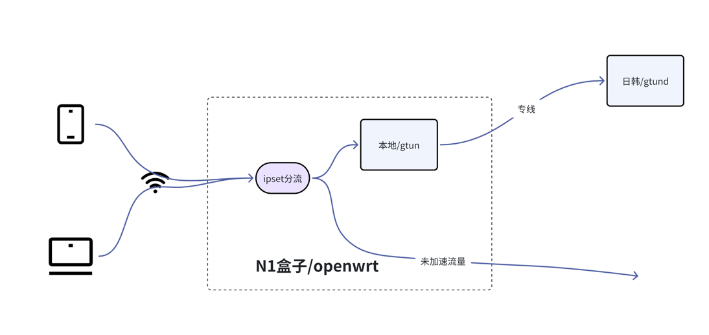

# 基于gtun实现的游戏加速盒
之前提到tiktok出海，在跨境领域还有很多场景，游戏就是另外一块比较大的应用场景。游戏又可以细分为两个领域。

- ToC的游戏加速，像市面上比较常见的UU，雷神，迅游这种，除了软件之外，有些还有游戏加速盒子
- ToB的游戏加速，针对游戏公司，游戏工作室需要海外发行游戏，但是希望给国内玩家提供服务

本文主要侧重在ToC的游戏加速，ToB的游戏加速有需要的客户可以先了解我们官网上的[全球加速产品](https://www.beyondnetwork.net)。

那么还是先来看看本文的一个简单拓扑。

跟tiktok几乎是一模一样，但是游戏场景没有tiktok的养号线路，因此全程都走的专线。

游戏场景同样也有IP的问题，我们对接过的游戏加速器厂商普遍都希望用本地运营商IP，我们可以提供运营商IP，也可以提供数据中心的IP。

同样，IP可以是独享的，也可以是共享的，正常情况下游戏共享的IP问题也不是很大，但是共享一个IP池的，然后选一个线路，每条线路对应一个IP。

# 游戏加速的产品化解决方案
我们的游戏解决方案提供以下服务：

- 基于gtun的流量劫持服务，搭载在Openwrt上做成一个游戏加速盒子
- 提供专线加速的能力，降低丢包和延迟
- 提供多种IP类型，包含运营商IP和BGP IP

以上是给普通的游戏玩家的，那么针对企业客户，我们有两个方向的合作。

- 如果您需要自己搭建一套这类游戏加速盒子，我们也可以提供技术支持和资源支持。
- 如果您是游戏工作室，可以使用我们的线路来帮您实现全球同服，国内玩家加速，公有云组网的场景

# 结束语
我们提供的所有的加速基本原理都是一样的，软件层面使用gtun来进行流量劫持和代理，针对不同的场景底层资源不一样。

针对普通的应用加速场景，不一定需要专线，只需要使用gtun然后配置kcp协议即可；

针对tiktok的加速，部分场景需要专线，部分场景不需要专线，但是对于gtun而言是透明的，gtun本身不需要感知是什么业务，是否使用专线；

针对游戏加速场景，我们强烈推荐专线，很多游戏对延迟和丢包非常敏感，而且游戏玩家能够很清楚的感知到延迟，丢包的影响。

