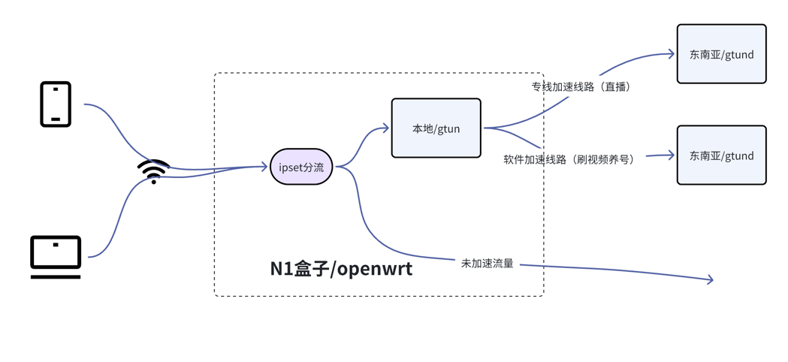
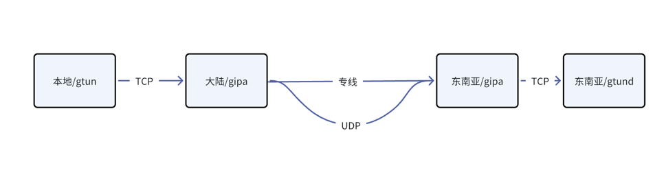

# 玩转N1盒子:基于gtun实现的tiktok加速路由
tiktok是目前出海比较火的一个场景，这个场景有以下问题需要解决：

- tiktok在国内访问不了，首先需要解决访问的问题
- tiktok需要独占出口ip，不然上传视频可能会0播，直播可能会被封禁
- 有的客户需要用本地运营商的IP，这部分我没有详细分析过不同IP带来的差异
- 客户对成本有不一样的要求，对于直播，客户希望用专线，而且通常带宽比较固定，5mbps就能够支持一个在线直播，对于普通的刷视频，传视频，客户不一定需要专线

这些场景有的是可以通过gtun解决的，有的比如运营商IP，专线，这类资源型的服务则是gtun程序本身解决不了的。

资源型的服务我们有企业专门提供，这部分对于我们不是什么太大的问题，我们比扬云专门作这种专线，组网以及IP的业务，感兴趣的可以到[官网](https://www.beyondnetwork.net)
了解更多。

言归正传，针对tiktok加速，我们提供了如下拓扑：

- 在终端还是基于N1盒子的软路由
- 代理软件还是使用的gtun/gtund配套
- 线路分为两块
  - 用于直播的专线线路
  - 用于养号的纯协议优化的线路，依赖的是gtun的kcp/quic这类协议

**本文适用于2.0.7及以上版本**

其他文章参考:

- [基础用法: 基于gtun+ipset实现ip代理加速和分流](基础用法_基于gtun+ipset实现ip代理加速和分流.md)
- [基础用法: 基于gtun+dnsmasq实现域名代理加速和分流](基础用法_基于gtun+dnsmasq实现域名代理加速和分流.md)
- [基础用法: openwrt搭载gtun打造加速软路由，连接Wi-Fi即可畅游网络](基础用法_openwrt搭载gtun打造加速软路由，连接Wi-Fi即可畅游网络.md)
- [基础用法: 基于gtun实现公有云访问外部加速](基础用法_基于gtun实现公有云访问外部加速.md)
- [玩转N1盒子：基于gtun实现的tiktok加速路由](玩转N1盒子_基于gtun实现的tiktok加速路由.md)
- [玩转N1盒子：基于gtun实现的游戏加速盒](玩转N1盒子_基于gtun实现的游戏加速盒.md)

# 配置
配置上与之前[基础用法:openwrt搭载gtun打造加速软路由，连接Wi-Fi即可畅游网络](基础用法:openwrt搭载gtun打造加速软路由，连接Wi-Fi即可畅游网络.md)
差别不大，只是底层线路上需要用到我们提供的专线，出口IP上需要用到独享的IP。

# 方案的缺点
这个方案有几个非常明显的缺点：

- 从本地出去，经过运营商再到海外，这个走的是UDP，UDP在一些地区的运营商可能会被拦截掉，导致掉线
- 一个软路由同时只能使用一个IP，这个是技术问题，比如同时tiktok的域名是`a.b.live.tiktok.com`，那么域名劫持的时候，结果只会写入到其中一个ipset里面，那么必然只能走一个IP出。

针对第一个问题，可以考虑把udp换成tcp，同时流量先经过国内公有云跳一跳，上到公有云之后再继续走的UDP协议。
针对专线则没有这个问题，专线包含国内和国外两个机器，传输质量较好，可以全程用tcp。

针对第二个问题，目前使用软路由暂时没有太好的解决方式，如果需要解决这个问题，有两个思路：

- 针对不同的内网IP进行匹配
- 使用小火箭，不实用软路由了

# tiktok的产品化解决方案

我们考虑了一段时间，还是考虑提供tiktok商家的解决方案，这个解决方案包括：

- IP，IP又包括运营商IP和云厂商IP
- 代理，可以基于gtun的软路由，也可以基于小火箭
- 线路，这个就比较复杂
  - 直连的线路，可能会被gfw封禁
  - 优化的线路，基于gtun和gtun的商业化产品[gipa](https://www.beyondnetwork.net)来提供性价比的线路
  - 部分专线线路，广港走专线，因为广港我们本身有资源，专线成本也比较低，很多客户都能接受
  - 全程专线，广港专线出，然后香港再专线到对应的国家，把出境线路收敛在广港

基于此思路我们做了一套tiktok解决方案

# 结束语
tiktok目前是出海领域非常火的方向，tiktok的网络解决方案是很多出海工作室的刚需，我们在软件的基础之上，加上自身拥有的基础设施资源，可以非常快速的适应这一场景。

